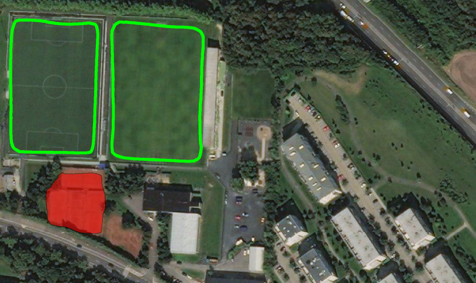

# i.ann.maskrcnn

## Description

Tools in this repository are designed to allow the user
to train his own Mask R-CNN model in GRASS GIS and to apply it to get vector
masks from raster data. This repository is a follow-up development of a project
created for my master's thesis
(see [here](https://github.com/ctu-geoforall-lab-projects/dp-pesek-2018)).
The library for these tools is heavily based on Python implementation of Mask
R-CNN by Waleed Abdulla, Matterport, Inc. (see
[here](https://github.com/matterport/Mask_RCNN)).

## Instalation

In GRASS GIS, the stable version of i.ann.maskrcnn.* modules can be installed
from the official AddOns repository by command:
`g.extension extension=i.ann.maskrcnn`

To install the working version from this repository, clone it and install into
GRASS with command:
`g.extension extension=i.ann.maskrcnn url=path/to/the/i.ann.maskrcnn/folder`

## Documentation

The official documentation is on the
[official web site](https://grass.osgeo.org/grass74/manuals/addons/i.ann.maskrcnn.html).

## Samples

